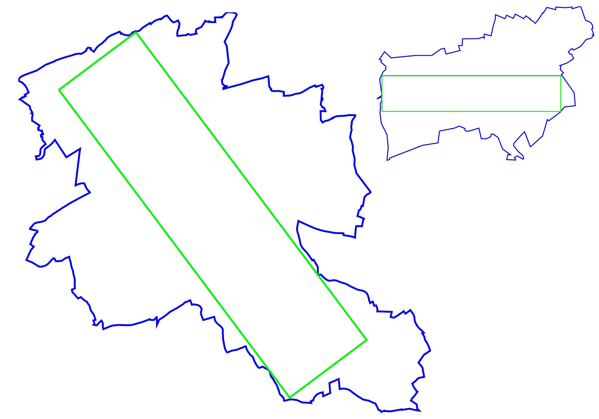
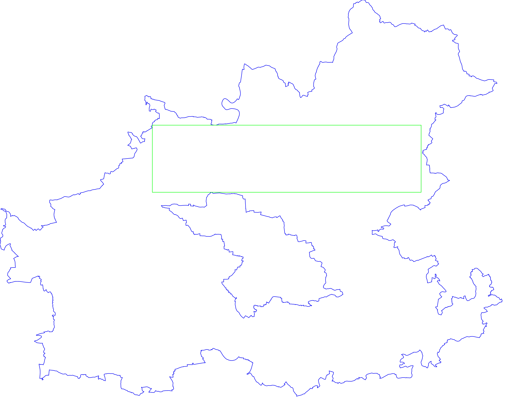

# Approximate Largest Empty Rectangle in Polygons
Approximate the largest empty rectangle inside general polygons with holes.

Automatically placing labels on maps is a problem relevant geographic
information systems. In this case, the shape of the label and, thus, the aspect
ratio is known.

This repository contains implementations of two algorithms for finding
Approximate Largest Rectangles Inside general Polygons with holes (ALRIP):

- `ap`: for finding axis-aligned rectangles
- `rr`: for finding arbitrary rotated rectangles

## Examples




## Prerequisites & Compiling

Prerequisites:
- C++ compiler (e.g., GCC, Clang)
- CMake (for building)

Compiling:

```sh
git clone https://github.com/mo42/alrip.git && cd alrip
mkdir build
cmake ../
make
```
# License

We distribute ALRIP under the MIT License.