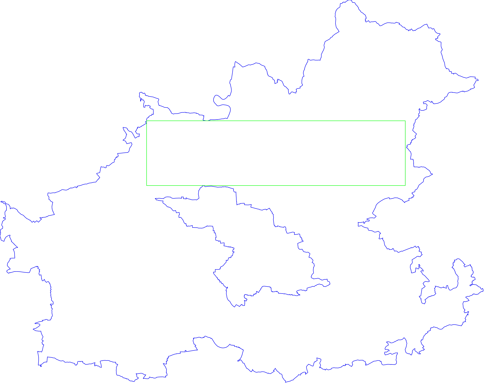
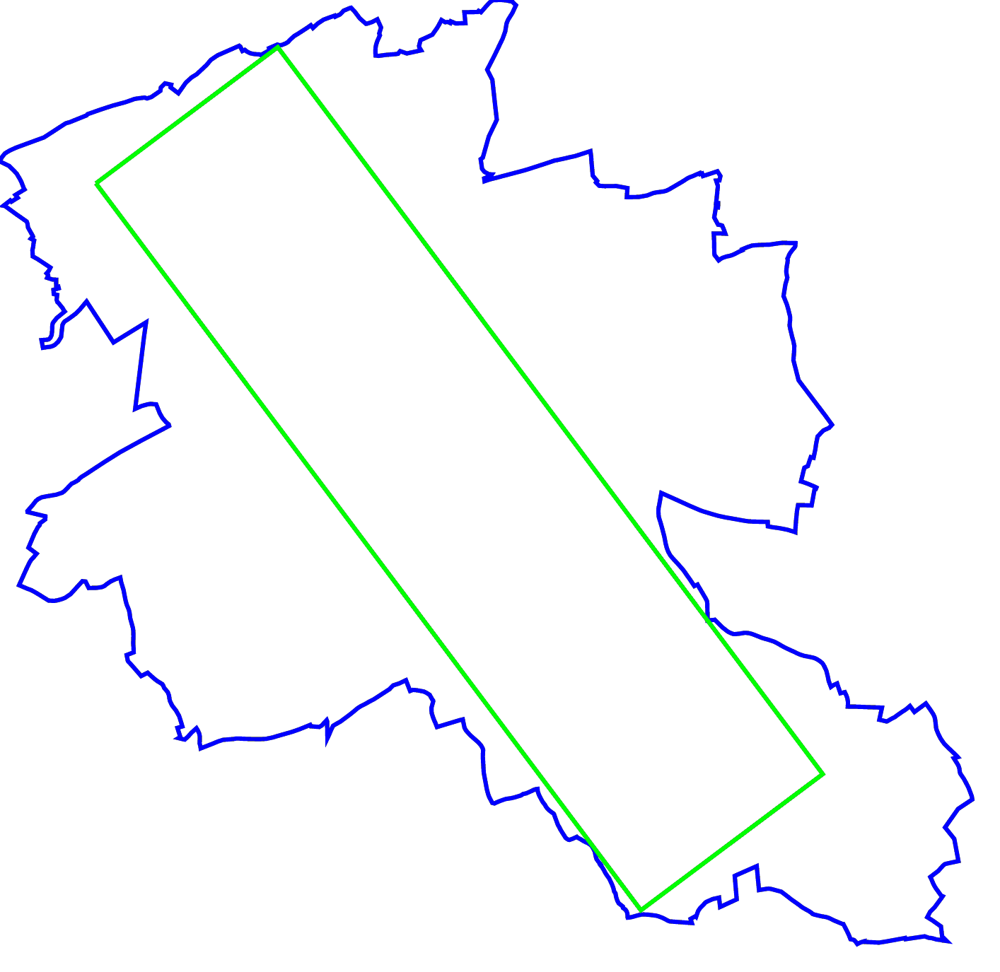
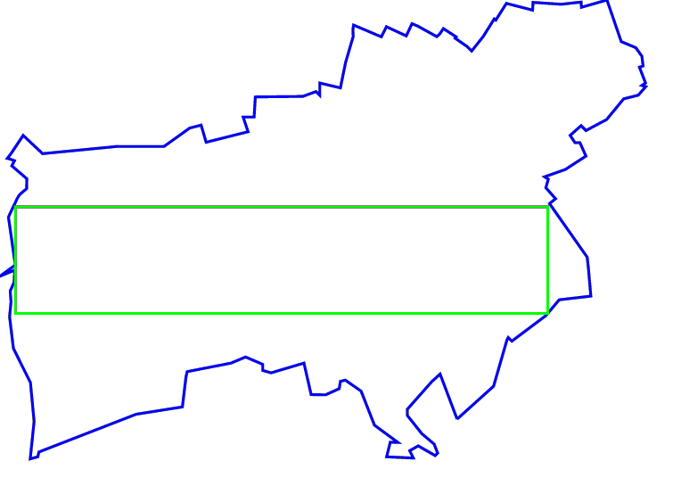

# Largest Empty Rectangle in Polygons
Compute the largest empty rectangle inside general polygons with holes.

## Motivation and Details
Automatically placing labels on maps is a problem relevant geographic
information systems. In this case, the shape of the label and, thus, the aspect
ratio is known.

This repository contains implementations of two algorithms for finding
(approximate) largest rectangles inside general polygons with holes:

- `ap.cpp`: axis-aligned rectangles
- `rr.cpp`: arbitrary rotated rectangles

## TODO
- [ ] Make library out of project and support common GIS format
- [ ] Use [CGAL](https://www.cgal.org/) for geometric primitives
